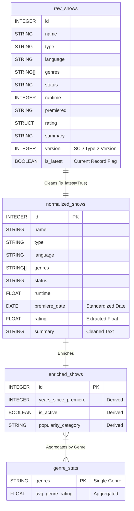

# Entity Relationship Diagram (ERD)

This document outlines the schema of the DuckDB tables created by the TVMaze ETL pipeline and the data flow between them.

```mermaid
erDiagram
    %% Raw Data Layer
    %% Ingested directly from JSONL
    raw_shows {
        INTEGER id
        STRING name
        STRING type
        STRING language
        STRING[] genres
        STRING status
        INTEGER runtime
        STRING premiered
        STRUCT rating
        STRING summary
        INTEGER version "SCD Type 2 Version"
        BOOLEAN is_latest "Current Record Flag"
    }

    %% Normalized Layer
    %% Cleaned and Validated Data
    normalized_shows {
        INTEGER id PK
        STRING name
        STRING type
        STRING language
        STRING[] genres
        STRING status
        FLOAT runtime
        DATE premiere_date "Standardized Date"
        FLOAT rating "Extracted Float"
        STRING summary "Cleaned Text"
    }

    %% Enriched Layer
    %% Derived Metrics Added
    enriched_shows {
        INTEGER id PK
        INTEGER years_since_premiere "Derived"
        BOOLEAN is_active "Derived"
        STRING popularity_category "Derived"
    }

    %% Analytics Layer
    genre_stats {
        STRING genres PK "Single Genre"
        FLOAT avg_genre_rating "Aggregated"
    }

    raw_shows ||--|| normalized_shows : "Cleans (is_latest=True)"
    normalized_shows ||--|| enriched_shows : "Enriches"
    enriched_shows }|--|{ genre_stats : "Aggregates by Genre"
```