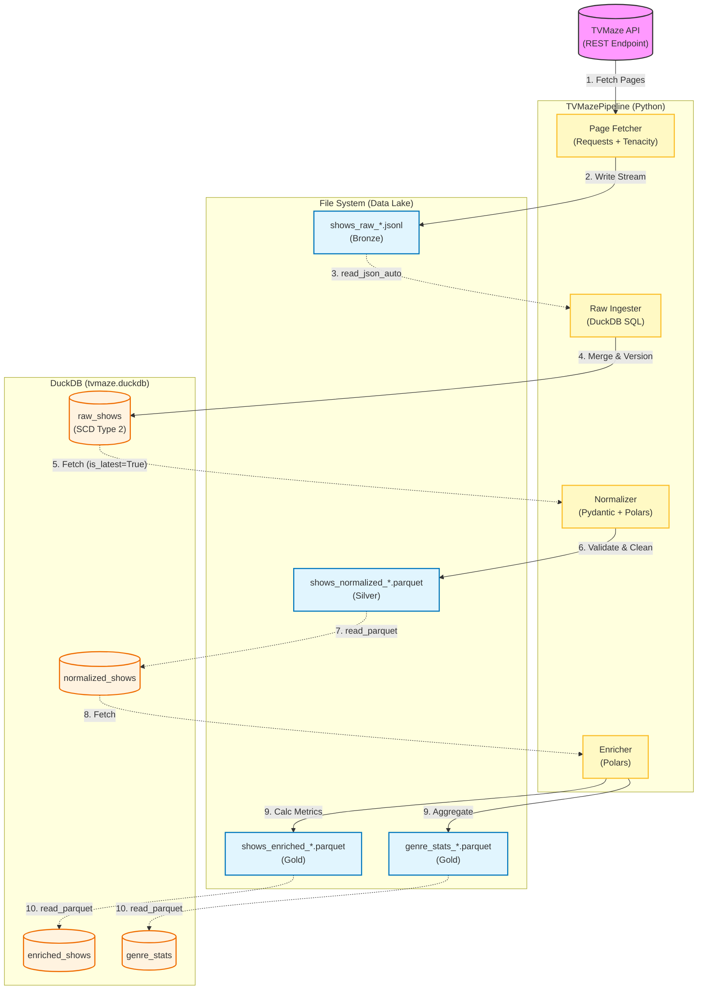

# Software Architecture Diagram

This diagram illustrates the end-to-end data flow of the TVMaze ETL pipeline, highlighting the interaction between the Python application, the File System (Data Lake), and the DuckDB Warehouse.

## 🔄 Process Flow: Step-by-Step

The following steps describe the lifecycle of a data packet moving through the TVMaze ETL pipeline:

### 1. Orchestration Trigger ⏱️
* **Action:** The pipeline is triggered manually via GitHub Actions (or on a schedule).
* **System:** A temporary Ubuntu Linux container spins up.
* **Logic:** The environment installs Python 3.9 and dependencies (`pandas`, `tenacity`, `pydantic`).

### 2. Extraction (Resilient API Calls) 📡
* **Action:** The `TVMazePipeline` class initializes.
* **Logic:** It calls the `GET /shows` API endpoint.
    * **Pagination:** Iterates page by page (`page=0`, `page=1`...) until 250+ items are collected.
    * **Resiliency:** If the API returns a `429` (Rate Limit) or `500` (Server Error), the `tenacity` library waits exponentially (2s, 4s, 8s...) and retries automatically.

### 3. Raw Data Persistence (The Bronze Layer) 🥉
* **Action:** Data is written to disk immediately.
* **Format:** `.jsonl` (Newline Delimited JSON).
* **Why:** This creates an immutable backup of the exact API response. If downstream processing fails, we can replay this file without re-fetching from the internet.

### 4. Validation & Cleaning (The Gatekeeper) 🛡️
* **Action:** The pipeline reads the Raw JSONL and passes every record through a **Pydantic Model**.
* **Logic:**
    * **Type Checking:** Ensures `id` is an integer and `rating` is a float. Malformed records are dropped/logged.
    * **Sanitization:** Uses **BeautifulSoup** to strip HTML tags (e.g., `
<b>`) from the summary field.
    * **Standardization:** Renames columns to `snake_case` (e.g., `premiered` → `premiere_date`).

### 5. Normalization (The Silver Layer) 🥈
* **Action:** Validated data is converted to a DataFrame and saved.
* **Format:** `.parquet` (Apache Parquet).
* **Why:**
    * **Compression:** Reduces file size by ~90%.
    * **Performance:** Columnar storage allows analytical queries to skip reading heavy text columns.
    * **Schema Enforcement:** Unlike JSON, Parquet strictly enforces data types (Date, Float, String).

### 6. Business Enrichment (The Gold Layer) 🥇
* **Action:** The `enrichment.py` script loads the Parquet file.
* **Logic:** It applies business rules to derive new insights:
    * **Popularity:** Categorizes shows as "Top-Rated" (>8), "Average" (6-8), or "Low" (<6).
    * **Longevity:** Calculates `years_since_premiere` based on the current date.

### 7. Analytical Transformation 📊
* **Action:** Generates the Genre Report.
* **Logic:**
    * **Explode:** Since a show has multiple genres (`['Drama', 'Sci-Fi']`), the system "explodes" the array so the show appears once per genre.
    * **Aggregation:** Groups by `genre` and calculates the average rating.

### 8. Data Publication 🚀
* **Action:** The GitHub Action detects the new files in `data/raw` and `data/normalized`.
* **System:** It performs a `git commit` and `git push` back to the repository.
* **Result:** The new data is available for analysts to query via DuckDB or SQLTools immediately.
* 

