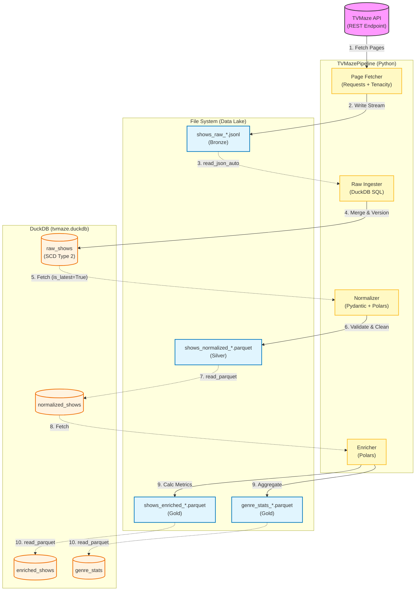

# Software Architecture Diagram

This diagram illustrates the end-to-end data flow of the TVMaze ETL pipeline, highlighting the interaction between the Python application, the File System (Data Lake), and the DuckDB Warehouse.

